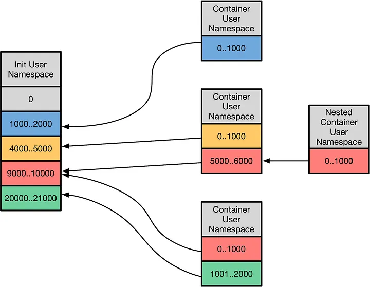

# Linux User Namespaces

## User Namespace

A **user namespace** is a Linux isolation mechanism that allows a process to have its own set of user and group IDs, separate from those on the host.

A process can therefore be assigned **UID 0 (root)** inside the namespace while being mapped to an ordinary, unprivileged UID on the host.



User namespaces also provide the process with **capabilities scoped to that namespace**. These capabilities can allow operations that normally require root, but they do not give the process unrestricted root privileges on the host. The kernel maintains the mapping between the namespace's UIDs and the host's UIDs. Thus, "root" inside a user namespace is not the same as root on the host.

## Objective

This demo illustrates how a Linux user namespace changes the identity and capabilities of a process without giving it root privileges on the host.

Normally, a user such as UID 1000 is an unprivileged user:

```bash
Host:
    UID 1000
```

Inside a user namespace, that same user can be mapped to UID 0:

```bash
User namespace:
    UID 0 (root)

Host:
    UID 1000 (ordinary user)
```

We will create a user namespace, become root inside it, and demonstrate that this gives us additional privileges inside the namespace while leaving our privileges on the host unchanged.

## Demo

Start a new user namespace with the current user mapped to root:

```bash
unshare --user --map-root-user bash
```

Check the identity:

```bash
id
```

You should see:

```bash
uid=0(root) gid=0(root) groups=0(root)
```

However, this is namespace root, not host root.

Check the UID mapping:

```bash
cat /proc/self/uid_map
```

You should see something similar to:

```bash
         0       1000          1
```

This means:

```bash
User namespace UID 0  →  Host UID 1000
```

## Demonstrating Namespace Privileges

Because we are root in the user namespace, we can perform operations that normally require root.

For example, create a mount namespace together with the user namespace:

```bash
unshare --user --map-root-user --mount bash
```

Create a mount point:

```bash
mkdir /tmp/my-mount
```

Mount a temporary filesystem:

```bash
mount -t tmpfs tmpfs /tmp/my-mount
```

Check it:

```bash
mount | grep my-mount
```

The process has namespace-scoped capabilities, including capabilities that allow this mount operation.

However, these capabilities do not make the process root on the host.

Try to modify the host's /etc:

```bash
touch /etc/user-namespace-test
```

This should fail:

```bash
touch: cannot touch '/etc/user-namespace-test': Permission denied
```

Exit the namespace:

```bash
exit
```

Then check your identity again:

```bash
id
```

You are back to your original UID:

```bash
uid=1000(...)
```

# Key Observation

A user namespace creates a different identity and capability context for a process:

                    HOST
                     │
               UID 1000
             ordinary user
                     │
                     │ UID mapping
                     ▼
              USER NAMESPACE
                     │
                  UID 0
                  "root"
                     │
          namespace-scoped capabilities
                     │
             ┌───────┴────────┐
             │                │
       namespace            host
       resources           resources
             │                │
          allowed          restricted

The important distinction is:

Root inside a user namespace is not root on the host.

The kernel allows the process to exercise certain capabilities within the namespace while continuing to enforce the host's privilege boundary.

This is one of the fundamental mechanisms behind unprivileged containers: a container process can run as UID 0 inside the container while corresponding to an ordinary, unprivileged UID on the host.
